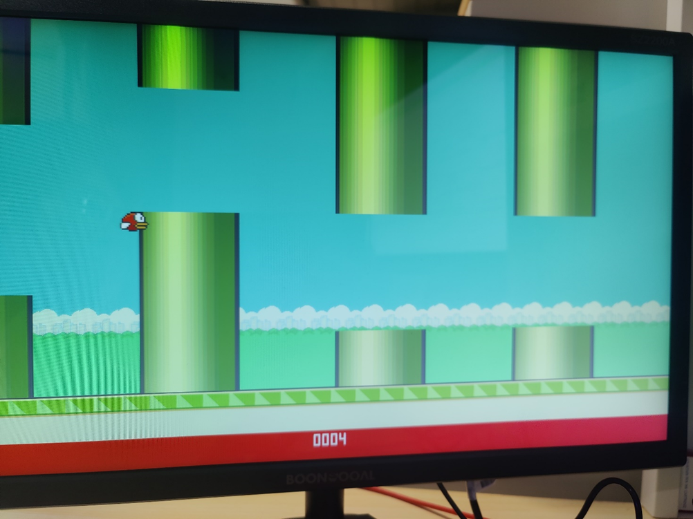
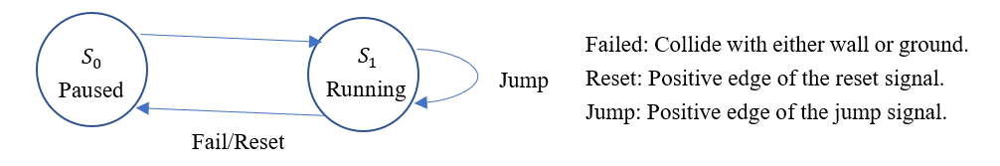
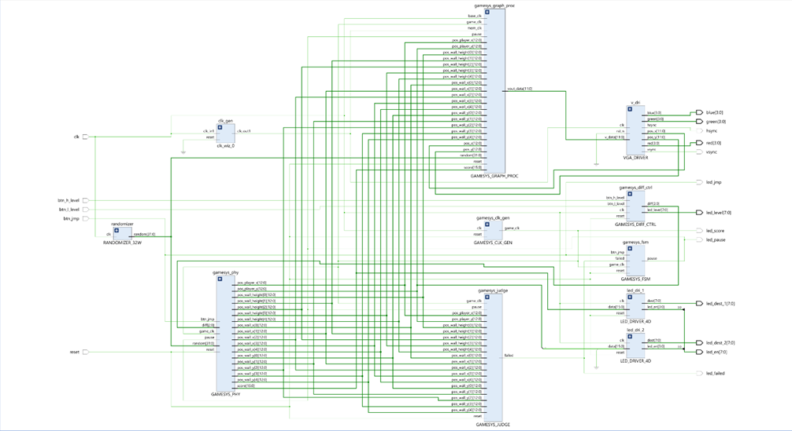

# CS211-Project-Flappy-Bird
CS211 Project Flappy Bird.

SUSTech Digital Logic Project.

## Score

Full score exceeded.

## Known Issues

Image tearing may happen under certain scenarios due to the fact that the update frequency of the physical simulation system is **too low** and the game rendering is running under **1080p@60Hz**. You may adjust the updating frequency by manually profiling the ``GAMESYS_CLK_GEN.sv`` module. Notice that the corresponding in-game velocities has to be modified in ``CONSTANTS.vh`` file. You may encounter such case in which the gravity happens to be too *heavy*. In that case you need to add a counter to determine the update frequency of the **vertical velocity of the player position**.

For a better viewing experience it may be forcibly required to perform such profiling.

**P.S. Due to the fact that we are left roughly one week to finish this project, this issue cannot be fixed right at the moment writing this document.**

## In-game Demonstration



## Usage

You shall follow the following steps in the order they are listed to prevent unknown errors from occurring. The following steps are performed in **Vivado 2017** to generate the corresponding bitstream file from the source code.

### Import files and constraints

Import all the files with ``.sv`` and ``.vh`` extension in the ``Sources`` folder. For convenience, you may create a new Vivado Project and simply copy the all the contents in the ``Sources`` folder into ``%ProjectName%\%ProjectName%.srcs\sources_1\new``.

Import the constraint file in the ``Constraints`` File. Notice that this constraint works only for the model **xc7a35tcsg324-1**, **Artix 7** made by **Xilinx**. You may need to modify the constraint file to adapt to other models. The detailed pin specification is listed in the next section.

### Loading assets & fonts

#### Loading all the assets

##### blk_mem_gen_3 (GAMESYS_GRAPH_PROC_BKGND, Background)

Instantiate a Vivado IP **Block Memory Generator** with its name specified as **blk_mem_gen_3**. You shall select the **Single Port ROM** option in the **Basic** tab. 

In the **Port A Options** tab you need to specify the **Port A Width** as **16** (which happens to be the size of a single pixel in ARGB 4/4/4/4 format), and **Port A Depth** as 25344. The size is predetermined by the size of the corresponding file. Untick the **Primitive Output Register** option to reduce the read latency to 1 clock cycle. 

In **Memory Initialization** tab, you shall tick the **Load Init File** option, and load the **Coe File** from ``Source\assets\bkgnd.coe``.

In the following asset loading procedures, we will only change the **Port A Depth** option and the **Coe File** specification. You shall repeat the above process with only these two parameters changed for the corresponding scenario.


##### blk_mem_gen_0 (GAMESYS_GRAPH_PROC_PLAYER, Player Entity 1)

Port A Depth: 3264

Coe File: ``Source\assets\bird_0.coe``


##### blk_mem_gen_1 (GAMESYS_GRAPH_PROC_PLAYER, Player Entity 2)

Port A Depth: 3264

Coe File: ``Source\assets\bird_1.coe``


##### blk_mem_gen_2 (GAMESYS_GRAPH_PROC_WALL, Wall Entity)

Port A Depth: 240

Coe File: ``Source\assets\tube_1d.coe``


#### Loading all the fonts

In the file **Sources\GAMESYS_GRAPH_PROC_S_PANEL.sv**, you shall change the following code segments to match the corresponding paths of the font files on your computer.

```systemverilog
initial begin
        $readmemh("%Absolute_Path%\\Sources\\fonts\\font_0.mem", font_lib, 0);
        $readmemh("%Absolute_Path%\\Sources\\fonts\\font_1.mem", font_lib, 1);
        $readmemh("%Absolute_Path%\\Sources\\fonts\\font_2.mem", font_lib, 2);
        $readmemh("%Absolute_Path%\\Sources\\fonts\\font_3.mem", font_lib, 3);
        $readmemh("%Absolute_Path%\\Sources\\fonts\\font_4.mem", font_lib, 4);
        $readmemh("%Absolute_Path%\\Sources\\fonts\\font_5.mem", font_lib, 5);
        $readmemh("%Absolute_Path%\\Sources\\fonts\\font_6.mem", font_lib, 6);
        $readmemh("%Absolute_Path%\\Sources\\fonts\\font_7.mem", font_lib, 7);
        $readmemh("%Absolute_Path%\\Sources\\fonts\\font_8.mem", font_lib, 8);
        $readmemh("%Absolute_Path%\\Sources\\fonts\\font_9.mem", font_lib, 9);
        $readmemh("%Absolute_Path%\\Sources\\fonts\\font_a.mem", font_lib, 10);
        $readmemh("%Absolute_Path%\\Sources\\fonts\\font_b.mem", font_lib, 11);
        $readmemh("%Absolute_Path%\\Sources\\fonts\\font_c.mem", font_lib, 12);
        $readmemh("%Absolute_Path%\\Sources\\fonts\\font_d.mem", font_lib, 13);
        $readmemh("%Absolute_Path%\\Sources\\fonts\\font_e.mem", font_lib, 14);
        $readmemh("%Absolute_Path%\\Sources\\fonts\\font_f.mem", font_lib, 15);
    end
```

### Initializing Clocking Wizards

You shall initialize the following clocking wizards with the corresponding name.

#### clk_wiz_0 (VGA Output Clock/Block Memory Synchronization Clock)

In **Clocking Options** tab, select **MMCM** and **Frequency Synthesis**, **Phase Alignment** and **Jitter Optimization: Balanced**. 

In **Output Clocks** tab, enable only ``clk_out1`` with **Output Freq (MHz) Requested: 148.5**, matching the clocking frequency required for VGA 1080p@60Hz output. In order to fetch the assets one clock ahead, you need to match the block memory clock with the VGA clock (this is just for convenience).

### Generating Bitstream File

You need to set ``MAIN.sv`` as the top file. (Right click on the file to set it as the top file). Then use Flow Navigator to generate the corresponding bitstream file. There is also a pre-generated one for validation placed under the root folder (named ``MAIN.bit``).

## I/O Pin Specification
The following ports have their rightmost bit as LSB. For example, the VGA ``red`` signal is declared as ``wire [3:0] red``, in which ``red[0]`` is the LSB.

| Port        | Direction | Width(bit) | Function Description                                         |
| ----------- | --------- | ---------- | ------------------------------------------------------------ |
| clk         | input     | 1          | Base Clock Signal  (100 MHz)                                 |
| btn_jmp     | input     | 1          | Jump Button                                                  |
| btn_h_level | input     | 1          | Increase Level Button                                        |
| btn_l_level | input     | 1          | Decrease Level Button                                        |
| reset       | input     | 1          | Reset Game                                                   |
| led_failed  | output    | 1          | Indicating Failure                                           |
| led_level   | output    | 8          | Indicating Difficulty Level                                  |
| led_score   | output    | 1          | Debug                                                        |
| led_jmp     | output    | 1          | Indicating whether the jump button is pressed and detected   |
| led_pause   | output    | 1          | Indicating whether the game is paused                        |
| led_dest_1  | output    | 8          | Manipulating the 7-seg led display to indicate score         |
| led_dest_2  | output    | 8          | Manipulating the 7-seg display to indicate  position of the player |
| led_en      | output    | 8          | Manipulating the 7-seg display switches to display 8  digits |
| red         | output    | 4          | VGA Output Signal                                            |
| green       | output    | 4          | VGA Output Signal                                            |
| blue        | output    | 4          | VGA Output Signal                                            |
| hsync       | output    | 1          | VGA hsync Signal                                             |
| vsync       | output    | 1          | VGA vsync Signal                                             |

## Overall Design & Functions



The system has three states: 1) Initialized (Or Reinitialized) and paused. 2) Failed and paused. 3) Running. 

Users could interact with the system through 2 difficulty adjustment buttons, 1 jump button, and 1 reset button. Users could check the status of the game through either onboard LEDs or on-screen indicators.

When the *jump* button is pressed, the game will start and the player entity will jump up a specific height. Every time the *jump* button is pressed, the vertical velocity of the player entity will be reset to a specific value, resulting in the player jumping a certain height immediately regardless of its velocity in the last game frame. The player’s velocity decreases and will eventually be heading to the ground by the ***gravity\*** implemented in the physical simulation subsystem. Displacements and accelerations are implemented according to the real physics laws (though *without drag forces*).

When the player entity collides with the wall (drawn on the screen with *green color*) or falls to the ground (the very bottom part on the screen), the system detects the failure through the score calculation & collision detection subsystem, terminates the current game and freezes everything, leaving the score panel (at the bottom of the screen) appearing as **red** (When the game is running, the score panel appears as **green**).

*Difficulty adjustment buttons* are used to switch the horizontal speed of the wall entities between different levels.

When the *reset button* is pressed, the game reinitializes, resets the score panel, re-randomizes all obstacles, and reset player’s attributes.

The obstacles (walls) appeared in the game have ***randomized\*** vertical position and height (As long as they are generated or recycled, they will have newly assigned values). Random numbers are generated using **Generalized Ring Oscillators** and **LHCA**s.

The entire game is drawn using priority rendering. When a position in the canvas has multiple objects in its place, object with higher priority is rendered.

The game also displays a *background* (showing colored skies with *randomized* white clouds), a real-time ***on-screen score*** ***indicator***, and all the game objects using either ***cached bitmap\*** (implemented through Block Memory Generator IP Core) or positional judgement inside the system. The game has *excellent* details.

The game supports 1920 * 1080 @60Hz VGA output.

## System Diagram


